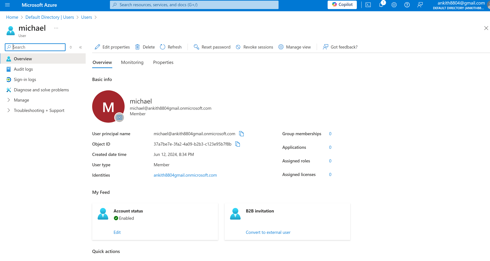
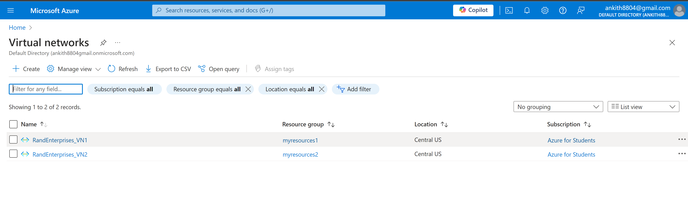
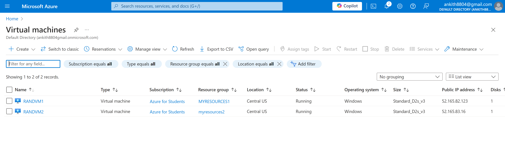
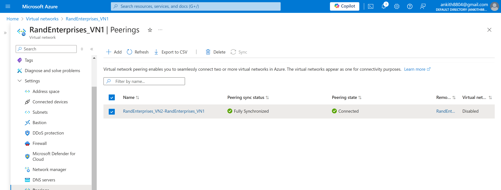
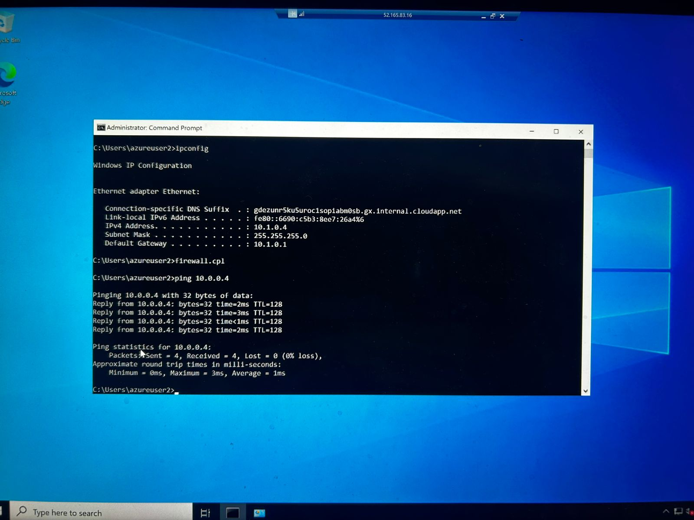
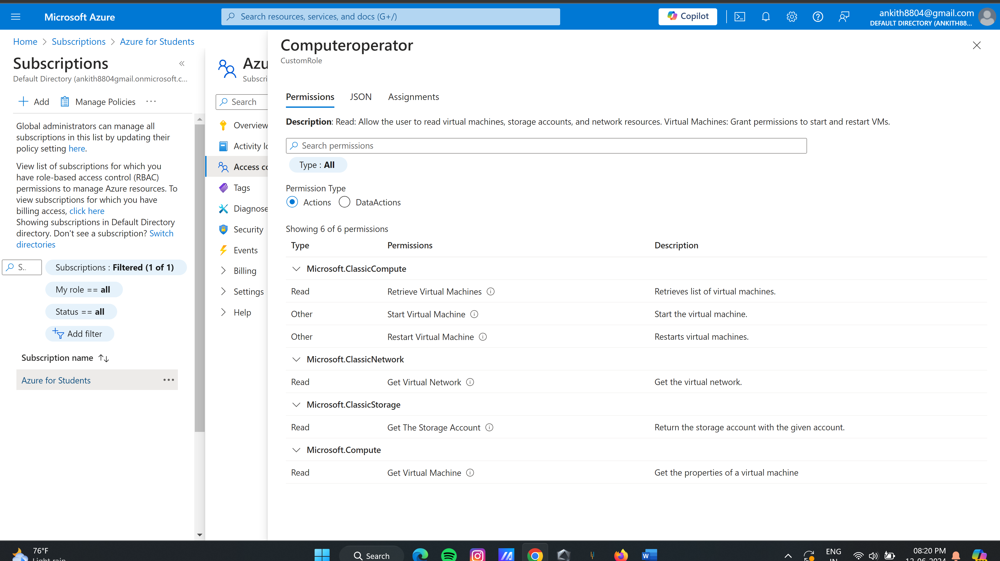
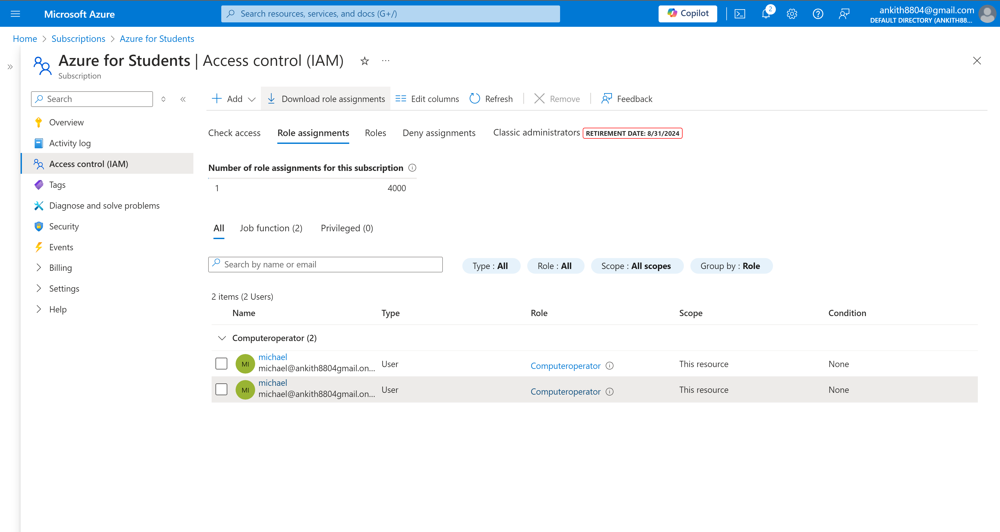

# Azure VNet Peering & Custom RBAC Role Project

This project demonstrates secure connectivity between Azure workloads using VNet peering and the assignment of a custom RBAC role to control access. The repo includes detailed stepwise instructions and all key output screenshots for deployment verification and learning.

## Features

- Creation of two Azure Virtual Networks with encryption and firewall enabled.
- Deployment of Windows Server 2022 VMs in each VNet.
- VNet peering setup to enable secure private network connectivity.
- Testing inter-VM connectivity using ping commands.
- Custom RBAC role creation in Azure Active Directory.
- Assigning and validating the custom RBAC role on a test user.

---

| User Onboarding               | Virtual Networks           | Virtual Machines            |
|------------------------------|---------------------------|----------------------------|
|  |  |  |

| VNet Peering                  | Ping Test                 | Custom RBAC Role           | RBAC Role Assignment       |
|------------------------------|---------------------------|----------------------------|---------------------------|
|  |  |  |  |

## Quick Start

Complete setup instructions and context can be found in the [Project Setup Guide](docs/project-setup-guide.md).

---

## Technologies Used

- Microsoft Azure Portal
- Azure Virtual Networks (VNet) & Peering
- Azure Virtual Machines (Windows Server 2022)
- Azure Active Directory & Custom RBAC Roles
- Network Security & Access Control

---

## Folder Structure

- `/architecture/screenshots/` - Output screenshots demonstrating each project milestone.
- `/docs/project-setup-guide.md` - Step-by-step deployment instructions.

---

## License

For educational and demonstration purposes only.
