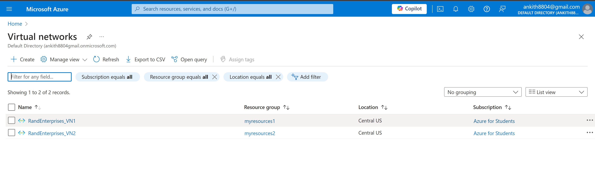
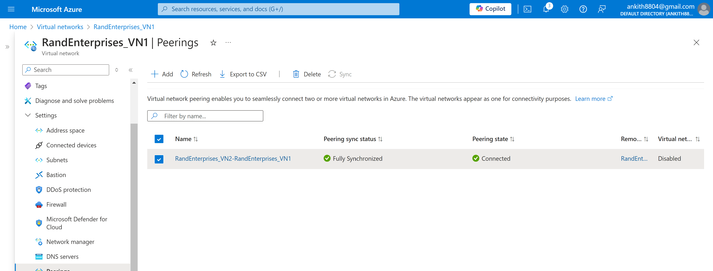

# Azure VNet Peering & Custom RBAC Role — Setup Guide

This guide walks through the process of securely connecting Azure workloads and assigning a custom RBAC role with detailed commands and output screenshots.

---

## 1. Create Test Virtual Networks

1. In the Azure Portal, create the first Virtual Network (e.g., `RandEnterprises_VN1`):
2. Select your region (e.g., Central US).
3. Under Security, enable Virtual Network Encryption and Virtual Network Firewall.
4. Keep other settings as default and click **Create**.

- Repeat to create the second Virtual Network (e.g., `RandEnterprises_VN2`) in the same region.

*Output Screenshot:*  

---

## 2. Deploy Virtual Machines

1.	Go to Azure portal and select Virtual machines
2.	Click on create virtual machines 
3.	Give the virtual machine a name, select the region and keep other things as default
4.	Under image select “windows server 2022 datacenter : azure edition  -x64 Gen 2” from the dropdown menu
5.	Under administrator account give the username and password
6.	Under inbound port rules, select allow selected ports https (80) anad rdp (3389)
7.	Click next
8.	Keep everything to default, click on create a new additional disk and create disk (this is     optional)
9.	Under Networking select virtual network 1 and subnet of that virtual network 
10.	Keep everything as default and click on next till u reach review + create
11.	Click on create
12.	Similarly you can create the second virtual machine by selecting the 2nd virtual network and subnet under the networking configuration

*Output Screenshot:*  

---

## 3. Establish VNet Peering

1.	Go to the first virtual network, search for peerings in the search bar above overview
2.	Click on add peerings
3.	Give the peering link name (virtualnetwork1-virtualnetwork2), select the 2nd virtual           network from the dropdown under virtual network
4.	Allow the necessary remote virtual network peering settings
5.	Give the local peering name (virtualnetwork2-virtualnetwork1)
6.	Allow the necessary peering settings
7.	Click on add
8.	You have created a VNet peering between the 2 virtual network 

*Output Screenshot:*  

---

## 4. Verify Connectivity via Ping

1.	First we need to connect the virtual machines in order to test the peering connectivity
2.	Go to the virtual machine 
3.	Click on connect and download the rdp file
4.	Run the file, click on connect and enter the password of the virtual machine 
5.	After connecting successfully 
6.	Open the command prompt in the virtual machine and type in ‘inconfig’ to get the IP  
7.	Type ‘firewall.cpl’ to go to firewall settings and turn it off, if firewall is enabled we      cannot connect the two networks
8.	Follow the same procedure for the 2nd virtual machine 
9.	Type ping (space) (IP address of the 2nd virtual machine)
10.	If you’re getting replies then testing is successful

*Output Screenshot:*  

---

## 5. Create & Manage User in Azure Active Directory

(e.g., `michael@domain.com`)
1.	Go to Microsoft extra ID (Azure Active directory is now Microsoft extra ID)
2.	Click on add > User > create new user (e.g., `michael@domain.com`)
3.	Give the necessary details like principle name, name and click next
4.	Fill out the details of the user and click on review+create
5.	Click on create, user is created

*Output Screenshot:*  

---

## 6. Create Custom RBAC Role

1.	Go to the Azure portal, click on subscriptions 
2.	Click on your subscription and click on Access control (IAM)
3.	Under Add select Add a custom role
4.	Give then role name (Computer operator) then write the description (• Read: Allow the user     to read virtual machines, storage accounts, and network resources.  • Virtual Machines Grant permissions to start and restart VMs.) 
5.	Click on next, click on add permissions and then select the read for virtual machines,         storage accounts and network resources
6.	Then add permissions to start and restart virtual machines
7.	Click on review+create and click create 

*Output Screenshot:*  

---

## 7. Assign Custom RBAC Role to the User

6.	Go to subscription > select the subscription 
7.	Go to access control (IAM), click on add and choose add role assignment
8.	Select the Computer operator role created before 
9.	assign it to the user 
10.	Click on review + create 
11.	Click on create

*Output Screenshot:*  

---

## 8. Validate User Permissions

- Log in as the assigned user.
- Check that the user can perform only permitted actions according to the custom RBAC role.
- This enforces least privilege access and secure operations.

---

## Summary

The project successfully connects Azure workloads with secure private networking and applies robust access control with custom RBAC. Output screenshots validate each critical step of the deployment.

---
