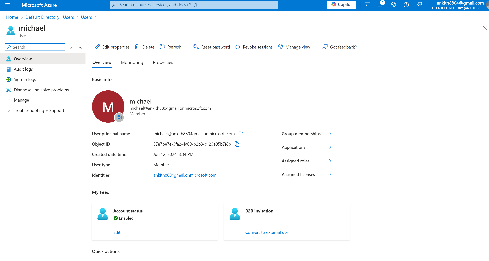
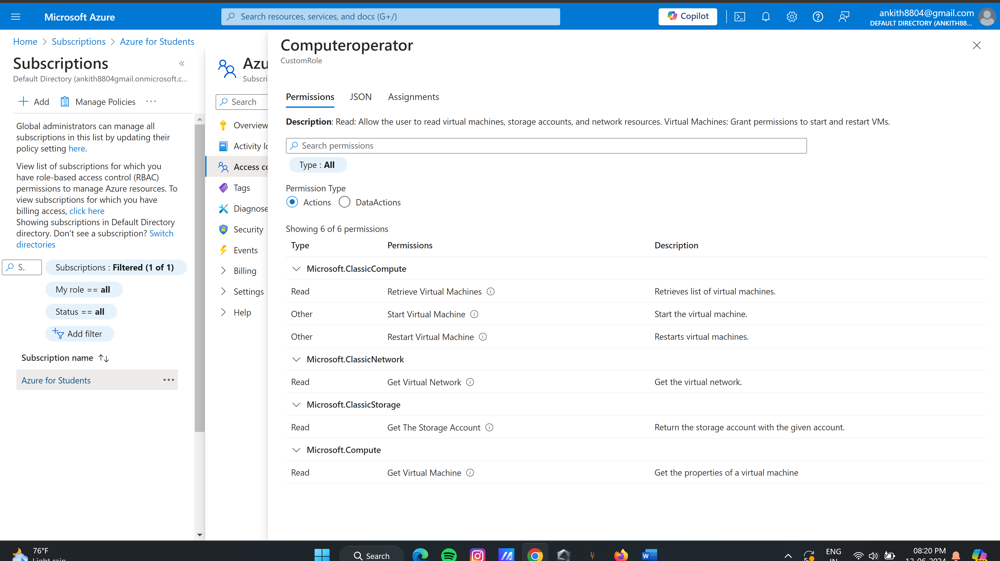
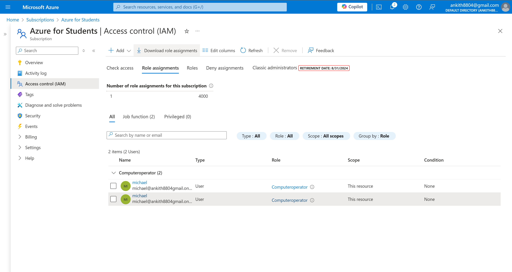

# Azure VNet Peering & Custom RBAC Role — Setup Guide

This guide walks through the process of securely connecting Azure workloads and assigning a custom RBAC role with detailed commands and output screenshots.

---

## 1. Create Test Virtual Networks

- In the Azure Portal, create the first Virtual Network (e.g., `RandEnterprises_VN1`):
  - Select your region (e.g., Central US).
  - Under Security, enable Virtual Network Encryption and Virtual Network Firewall.
  - Keep other settings as default and click **Create**.

- Repeat to create the second Virtual Network (e.g., `RandEnterprises_VN2`) in the same region.

*Output Screenshot:*  

---

## 2. Deploy Virtual Machines

- For each virtual network, deploy a Windows Server 2022 Datacenter (Azure Edition - x64 Gen 2) VM.
- During the setup, add a new additional disk if required (optional).
- Keep the rest of the default settings.
- After creation, open the VM and run `ipconfig` in Command Prompt to check the internal IP address.

*Output Screenshot:*  

---

## 3. Establish VNet Peering

- In the Azure Portal, go to the first VNet's "Peerings" section.
- Create a peering connection to the second VNet.
- Repeat the process from the second VNet back to the first to enable bi-directional connectivity.

*Output Screenshot:*  

---

## 4. Verify Connectivity via Ping

- Log into one VM and ping the internal IP of the other VM.
- Successful replies confirm active VNet peering.

*Output Screenshot:*  

---

## 5. Create & Manage User in Azure Active Directory

- Add a new user (e.g., `michael@domain.com`) to your Azure Active Directory.
- Configure properties and ensure the account is active.

*Output Screenshot:*  

---

## 6. Create Custom RBAC Role

- Define a custom RBAC role with the required permissions to operate workloads securely.
- This can be done in the Azure Portal or by uploading a JSON definition.

*Output Screenshot:*  

---

## 7. Assign Custom RBAC Role to the User

- Go to Access Control (IAM) for the target resource group or subscription.
- Choose “Add role assignment”, select the custom role, and assign it to the new user.
- Confirm the assignment is applied.

*Output Screenshot:*  

---

## 8. Validate User Permissions

- Log in as the assigned user.
- Check that the user can perform only permitted actions according to the custom RBAC role.
- This enforces least privilege access and secure operations.

---

## Summary

The project successfully connects Azure workloads with secure private networking and applies robust access control with custom RBAC. Output screenshots validate each critical step of the deployment.

---
